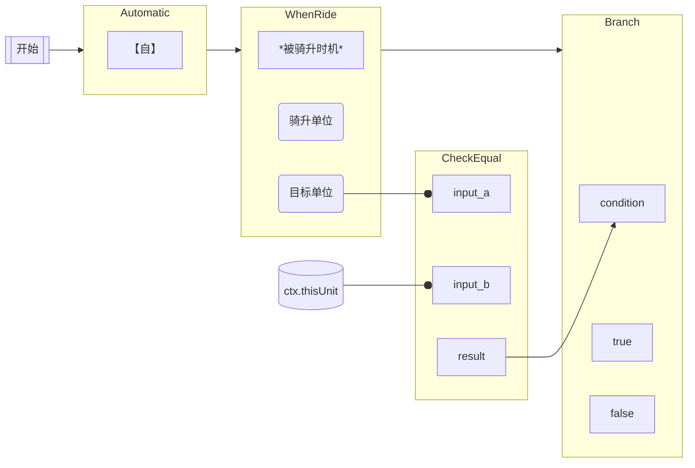
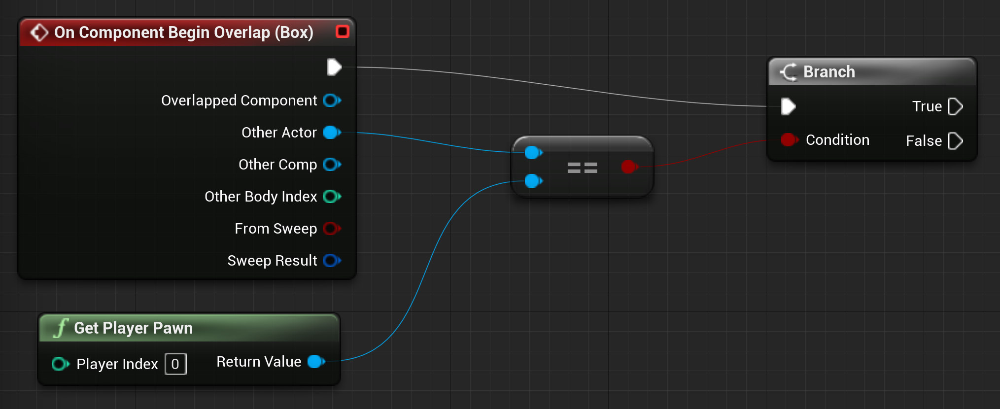

# 开始放弃 sentences 的设计

## 之前的设计

希望通过拼接句式，句式嵌套不同子句的方式来实现效果逻辑

> 例如：
> 【自】：这个单位被骑升时，如果你是后攻，则抽1张卡。

可以拆解为

- x 时，如果 y，则 z
  - x: 这个单位被骑升时机
  - y: 判断你是后攻
  - z: 抽1张卡

## sentences 之间的上下文传递过于复杂

> 例如：
> 满足 x 时可以支付 y，则进行...。如果满足 z ，则作为 y 的替代，进行 y2

这样的上下文处理不只是涉及到操作的目标信息，还包括动作本身

而且在 sentences 处理时，需要考虑后续执行的 sentences 可能会有替代的前面的动作，使得执行时机的复杂度

# 诉求

一开始目的是满足两个条件：

1. 效果定义通过纯结构化数据表述（无需代码）
2. 实现 1 后通过 GUI 进行配置

# 新设计逻辑

效果使用类似 blueprint 节点来配置

- 管道组成一个完整的效果定义
  - 管道内部可以包含多个节点
  - 先注册，后执行
  - 节点可以感知上下文，并修改其他节点

> 例如：
> 【自】：这个单位被骑升时，如果你是后攻，则抽1张卡。

